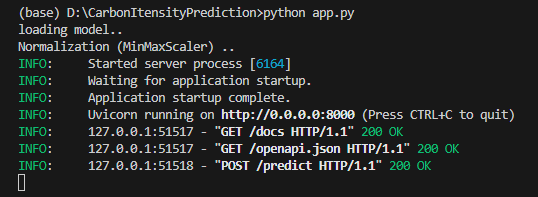
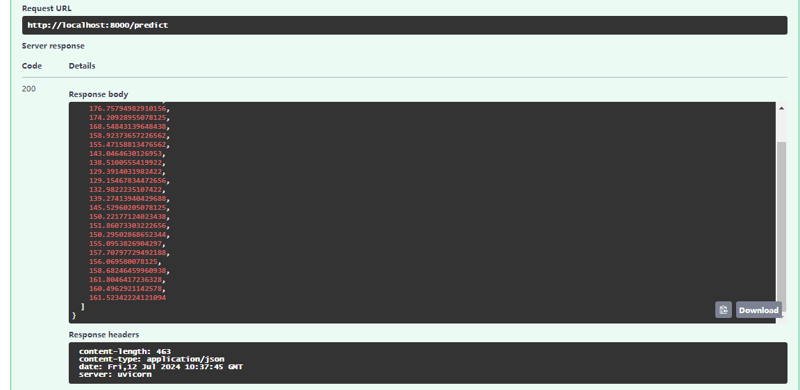

# Forecasting for carbon intensity

## Before start it
In a limited time, I think the most important is first to have a basic understanding of the given dataset, then just train a model on it to see if the model could work on the dataset. Considering the scalability of the current work for future development is also important.

## overview of this project
After run the file, "understand_data.ipynb", you will be able to get two files, which are "dk_dk2_clean.csv" and "one_batch.csv".

The code for training and testing model is in "run.py". If you want to test this file, "run.py", run
~~~python
python run.py --config-name=carbon
~~~

Please remember to create new config files, like change the model_id or other parameters. Otherwise, the previous results will be replaced by new results.

### some parameters in config file
1. model's name represents the name of the model, only ConvLSTM is avaliable now.
2. model's id will be associated with the checkpoints and the results in "test_results" folder.
3. data's path is the relative path of the data
4. epochs, learning_rate, batch_size are the hyper-parameters
5. n_feature is the number of features in the dataset, at here, it is 50
6. n_future is the length of future horizon, at here, it is 24
7. n_past is the length of history horizon, at here, it is 168.
8. n_predict is the number of feature we want to predict. Default is 1. (only work with 1 currently)

## understand the dataset
In the Jupyter Notebook titled "understand_data.ipynb", I presented the process of preprocessing the given dataset (DK-DK2). This includes several steps: dropping empty and less important columns, checking the correlation among features, filling NaN values using the forward fill method, and manually removing outliers. After these basic preprocessing, I got a "clean" dataset named as "dk_dk2_clean.csv". Detailed explanations can be found in the notebook file.

To test if I can use FastAPI to use my trained model, I took the last 168 rows of data from "dk_dk2_clean.csv", and saved it as "one_batch.csv". (the length of my history horizon is 168)

## FastAPI
For test the trained model using example data, run
~~~python
python app.py
~~~

## Forecasting
The processed dataset, "dk_dk2_clean.csv", contains 41380 rows, and 50 columns (can be found in notebook file). My goal is the forecast the carbon intensity( at the last row) of this dataset for the next 24 hours based on the past values of all 50 features. Therefore, I consider this is a multi-step ahead , multivariate time series forecasting problem.

Since the time unit in this dataset is one hour. I set the **history horizon** (n_past in the code) to be 168 (a week, 24*7=168), and the **future horizon**(n_future in the code) to be 24. In current setup, the model is able to predict the next 24 values of carbon intensity based on the last 168 observations of all 50 features in the dataset.

### preprocessing
I used the MinMax scaling and the sliding window methods to prepare the data for training model. I didn't shuffle the dataset in order to keep it's temporal information.

### training
The first 70% of the entire data points has been integrated with 5-folds cross validation for training and validation. Early stopping has been used to avoid overfitting during the training process. Currently, I only have one ConvLSTM model.

### testing
The trained model will be evaluated on the last 30% of the entire data points using four evaluation metrics, including RMSE, MSE, MAE and R-squared. These metrics are calculated on the original values after rescaling.

## Scalability
1. work on different data file
2. test different models, including LSTM, CNN etc.
3. forecast different targets
4. test different history horizon and future horizon
5. test different hyper-parameters (epoches, learning_rate, batch_size)

## Limitation
1. Quality of the dataset: simple preprossing of the given dataset could not ensure its quality.  
2. Hyper-parameter optimization: perform hyper-parameter optimization would be help to identify the optimal structure for this problem, and might greatly improve the model's performance.
3. Single Target Feature Prediction: Currently, the model is restricted to predicting only one feature due to the method of feature scaling employed. Initially, MinMax scaling is applied to the training set consisting of 50 features. Subsequently, the same scaler is used for both the validation and testing sets. When predicting a single feature, I replicate the single row along the second dimension 50 times. This allows for an inverse transformation, and the I can select the target column. Consequently, predicting multiple features simultaneously within the current setup isn't feasible. To address this, separate scalers would be necessary to independently scale X and y.

## Future work

### fit on more target features(more than 1)
Try to use separate scalers to scale X and y, so I will be able to predict multiple features at the same time.

### improve the forecasting results
As the metrics of current model are not quite good (see "carbon_log.txt"), for example, the R-squared is quite low. There are some approaches that can help to better metrics.

The first one is the quality of the processed dataset("dk_dk2_clean.csv"). It's necessary to get a higher quality dataset with better approaches. For example, searching better solutions for removing outliers for periodic features.

Second, performing hyper-parameter optimization to get the optimal model for this problem. Optimizing hyperparameters can significantly enhance model performance by finding the best configuration for training.

Third, considering a strategy where the model is trained for single-step ahead prediction (SSAP) and then recursively called to predict subsequent values. Despite potential error accumulation in recursive predictions, this approach might show better performance compared to multi-step ahead prediction methods.

Lastly, exploring other DL models, like CNN, LSTM, and Transformer.
